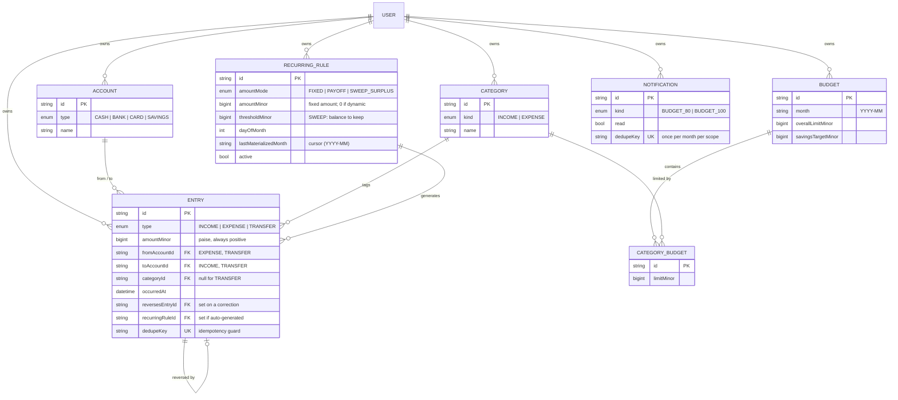

# Smart Ledger

### ▶︎ Live demo — **[https://smart-ledger-aditya.vercel.app/](https://smart-ledger-aditya.vercel.app/)**

Open the link and you're straight in: the login is pre-filled with the demo account, so there's
no signup or setup. It loads with 3 months of realistic data to explore.

A personal finance ledger you actually run your money through. With Smart Ledger you can:

- **Record income, expenses and transfers** across separate Cash, Bank, Card and Savings
accounts — money moving between your own accounts is a *transfer*, not a spend.
- **See your money live** — net worth and every account balance, always computed from your
real transaction history.
- **Budget your spending** — set an overall monthly budget and per-category limits, and track
actual spend against them with live progress bars.
- **Get alerted before you overspend** — a notification bell warns you the moment a category
crosses 80% of its budget, and again when it goes over 100% — deduped so you're never spammed.
- **Automate recurring money** — not just fixed repeats like a ₹649 Netflix charge, but rules
that **clear your credit card in full every payday** and **sweep whatever's above your Bank
cushion into Savings**, with the amount worked out from your live balance each month.
- **Chase a savings goal** and watch the progress ring fill.
- **Fix mistakes without deleting anything** — reverse any transaction; the ledger is
append-only, so your history always stays intact and auditable.
- **Settle a card to ₹0 in one click**, filter and browse your full transaction history, and
use it in light or dark mode, on desktop or mobile.

It's a single-user web app built with **Next.js + TypeScript + PostgreSQL**.

---


## What it does

- **First-open** → collects name + email (no password, single-user) and seeds default
accounts (Cash / Bank / Card / Savings) and the fixed category set. **Authentication is
intentionally omitted to keep the demo frictionless** — a reviewer can open the link and be
using the app in seconds, with no signup, password or email verification in the way. It's
scoped out for this exercise, not overlooked — real auth and per-user isolation would slot
in behind the same single-user session boundary the app already uses.
- **Onboarding** (skippable) → monthly salary, overall budget, per-category budgets, savings
target. The salary is written as a *real* income entry so the ledger reconciles.
- **Dashboard** → net worth + account balances (animated count-up), overall budget bar,
per-category budget bars, savings-target ring, a spend-by-category donut, and a
budget-vs-actual bar chart. Notification bell.
- **Add entry** → income / expense / transfer, with an optional "make this recurring" toggle.
- **Transactions** → filter by month / category / type, paginated, with a **reverse** action
(appends a reversing entry — never a hard delete).
- **Recurring** → CRUD for monthly rules + a "Run now" materializer.
- **Profile** → edit budgets, targets and category limits for any month.
- Light / dark theme, fully responsive (desktop sidebar → mobile bottom-tab bar).

---


## What's in the demo (so you can see every feature)

The live link (or a seeded local run) loads **3 months** of realistic data. Things to look at:

- **Dashboard** — net worth derived from the ledger, an overall budget bar, a savings-target
ring (~59% of ₹3,00,000), a spend-by-category donut, and a budget-vs-actual chart. Note the
**bell** shows 2 alerts (Food near its limit, Entertainment over 80%).
- **Recurring** — three self-explanatory rules, all live:
  - **Netflix subscription** — a plain *fixed* ₹649 every month.
  - **Clear credit card on payday** — an *auto payoff*: on day 1 it moves *exactly what the
  Card owes* from Bank, so the card gets zeroed each cycle (it still shows this month's
  fresh spend). The amount is computed from the balance — the rule row shows "auto".
  - **Sweep Bank surplus over ₹40,000 to Savings** — an *auto sweep*: keeps ₹40k in Bank and
  moves the rest to Savings each month. This is what grows the savings ring.
- **Transactions** — filter by month/type/category; every row is append-only. One entry is a
**reversal** (a "Duplicate charge (refunded)" that was reversed) — the "delete/edit" of an
immutable ledger. Try the **Reverse** action on any normal row.
- **Accounts** — Bank sits at exactly ₹40,000 (the sweep floor), Card is **negative** (real
credit-card debt), Cash is funded by a monthly ATM-withdrawal transfer, Savings grows via
the sweep. Transfers never change net worth. Any account in the red shows a **Settle** button
that pays it off in full in one click — the amount is computed server-side from the live
balance, so it always clears to exactly ₹0.

---


## Where AI helped, and where I directed it

I used **Claude Code** as the coding assistant to move fast on the boilerplate — route
handlers, the UI component layer, chart config, and the demo seed. I drove the architecture
and every real decision, and I deliberately set it up to **check its own work** instead of
trusting the first output: it drove a real browser with Puppeteer / Chrome DevTools to
screenshot every page in light, dark and mobile and confirm **zero console errors**, and ran
scripted ledger checks to prove the numbers added up. Where it got something wrong, I caught it
and corrected the approach — the specifics below.

### Features I designed and directed

The financial-ledger basics are table stakes. The parts that make this app stand out came from
me steering the AI, not the other way round:

- **Automatic monthly transactions — then *smart* ones.** First I asked for "recurring"
transactions: entries that get added on their own every month so you don't type them in each
time, like a ₹649 Netflix charge. Then I pushed the idea further — what if the app could
figure out the *amount* on its own instead of me fixing a number? That became the two
standout rules: **on payday, clear whatever the credit card owes** (however much you spent
that month), and **move whatever's sitting above a set amount in your Bank into Savings**.
The app checks your real balance the moment each rule runs and works out the amount itself —
nothing is hardcoded.
- **The budget alert bell.** I wanted overspending to be impossible to miss, so I directed a
notification bell: the moment a category's spend crosses 80% of its budget — and again when
it goes over 100% — an alert lands in the bell, instead of the app staying silent.


### Bugs I caught in its output

Two logic mistakes the AI wrote that looked fine on the surface and only showed up once I
actually exercised the app:

- **Two alerts for a single overspend.** A large expense that pushed a category from under 80%
straight past 100% in one go fired *both* the "80% used" warning and the "over budget"
warning at the same instant — two notifications for the same event. I changed it to raise
only the most severe one.
- **Recurring redoing all its work every time.** The recurring engine re-checked *every* month from a rule's start date on every single app load — so a rule that had been running for years did dozens of pointless checks on each visit, producing nothing new. I added a cursor (`lastMaterializedMonth`) so it only resumes from the months it hasn't already handled.

---


## Tech stack

Next.js 16 (App Router) + TypeScript · PostgreSQL + **Prisma 7** (driver-adapter / `pg`) ·
Tailwind CSS v4 + a small shadcn-style component layer · Framer Motion (count-up, ring fill,
page transitions) · Recharts (2 charts) · Zod (every mutation) · pnpm · Docker.

---


## Architecture — key decisions

Everything hangs off one idea: the `Entry` **table is an immutable, append-only ledger** at the
centre of the schema. Rows are never updated or deleted — a correction is a *new* row that
points back at the one it reverses (`reversesEntryId`), and everything else (balances, net
worth, budget usage) is *derived* from these rows rather than stored.




- **Append-only & immutable.** An "edit" or "delete" is a new *reversing* entry that negates the
original (`[lib/entries.ts](src/lib/entries.ts)`) — history stays complete and auditable, no
row is ever mutated.
- **Balances are derived, never stored.** No running-total column to drift. Account balances,
net worth, category spend and budget-remaining are recomputed from `Entry` on every read
(`[lib/ledger.ts](src/lib/ledger.ts)`).
- **A transfer isn't an expense.** Moving money between your own accounts (`fromAccountId` +
`toAccountId`, no category) leaves net worth unchanged and never touches a budget.
- **Idempotent generation.** Recurring entries and budget alerts each carry a deterministic
`dedupeKey` under a unique constraint, so a re-run — app load *and* manual, or after being
offline for months — can never double-insert (`[lib/recurring.ts](src/lib/recurring.ts)`,
`[lib/budget.ts](src/lib/budget.ts)`).
- **Typed errors.** Every mutation is Zod-validated; failures map to typed HTTP statuses
(400/401/404/409), with a generic 500 that never leaks internals
(`[lib/errors.ts](src/lib/errors.ts)`).
- **Integer money.** Amounts are `BigInt` paise end-to-end — no `parseFloat`, no float drift.
Since `BigInt` can't cross JSON, money travels as a decimal string and the client re-parses it
with the same formatter the server uses (`[lib/money.ts](src/lib/money.ts)`).

**Data model:** `User · Account · Category · Entry · Budget · CategoryBudget · RecurringRule · Notification` (`[prisma/schema.prisma](prisma/schema.prisma)`) — money columns are `BigInt`,
`dedupeKey`s are uniquely constrained, and deleting a `User` cascades to all their data.

**API:** REST route handlers under `[src/app/api](src/app/api)` cover users, preferences,
entries (+ reverse), summary, notifications, and recurring rules (+ run) — every mutation
Zod-validated behind the typed-error layer above.

---

## Project structure

```text
src/
  app/
    (app)/               # signed-in pages: dashboard, add, transactions, recurring, profile
    api/                 # REST route handlers: entries, summary, recurring, notifications, …
    onboarding/          # first-run salary + budget setup
    page.tsx             # welcome / sign-in
  components/
    app/                 # UI widgets: budget bar, savings ring, notification bell, settle button
    charts/              # Recharts: spend donut + budget-vs-actual bars
  lib/                   # the domain core — all business logic, UI-free
    ledger.ts            # derive balances & net worth from Entry rows
    entries.ts           # create entries + reversals (append-only)
    recurring.ts         # idempotent materializer + dynamic payoff / sweep amounts
    budget.ts            # budget usage + threshold → notification logic
    money.ts             # BigInt paise ⇄ rupee string, at the edges only
    validation.ts        # Zod schemas for every mutation
    errors.ts, http.ts   # typed error hierarchy → HTTP status mapping
    session.ts, db.ts    # cookie session + Prisma client
prisma/
  schema.prisma          # the data model (diagram above)
  migrations/            # versioned SQL migrations
  seed.ts                # reproducible 3-month demo dataset
```

One rule holds it together: **`src/lib` owns the business logic and never imports React.** Pages
and route handlers stay thin and call into it, so the API and UI share the exact same money
formatter and Zod validation, and the ledger logic stays testable on its own.

---

## Run it locally

You don't need to — the [live demo](https://smart-ledger-aditya.vercel.app/) is the fastest
way to try it. This section is here for completeness if you want to run it yourself.

### Option A — one command (Docker: app + Postgres)

```bash
docker compose up --build
```

This starts Postgres, waits for it to be healthy, applies migrations, seeds a demo user, and
serves the app. Then open **[http://localhost:3000](http://localhost:3000)** and sign in with:

> **Name:** `Test`  **Email:** `test@gmail.com`

(or enter a brand-new email to start from an empty ledger and walk through onboarding).
Start empty instead of seeded: set `SEED=false` in `docker-compose.yml`.

### Option B — local dev

```bash
# 1. Start just Postgres
docker compose up -d postgres

# 2. Install deps + set env
pnpm install
cp .env.example .env        # DATABASE_URL already points at the compose Postgres

# 3. Migrate + seed
pnpm db:deploy              # or: pnpm db:migrate  (dev migrations)
pnpm seed

# 4. Run
pnpm dev                    # http://localhost:3000
```

**Re-seed a different profile:** edit the `CONFIG` block at the top of
`[prisma/seed.ts](prisma/seed.ts)` (salary, budgets, savings target, months) and run
`pnpm seed` again. The seed resets the demo user each run and uses a fixed random seed, so
data is realistic *and* reproducible.

### Option C — deploy to Vercel + Neon (a shareable link)

The app is a standard Next.js app driven entirely by `DATABASE_URL`, so any hosted Postgres
works. This project is deployed on **Vercel** with a **Neon** serverless Postgres.

1. Create a Postgres database on [Neon](https://neon.tech). For an India audience, pick the
  **Singapore (ap-southeast-1)** region and set Vercel's **Function Region** to Singapore too,
   so the function↔DB round-trips stay local. Copy the connection string.
2. Initialize the database once from your machine (build doesn't run migrations):
  ```bash
   DATABASE_URL="<neon-url>" pnpm exec prisma migrate deploy
   DATABASE_URL="<neon-url>" pnpm seed
  ```
3. Import the repo on Vercel and set the `DATABASE_URL` env var to the Neon URL (Production +
  Preview). The build runs `prisma generate && next build` automatically; API routes run on
   the Node.js runtime, so the `pg` driver adapter connects to Neon over SSL with no code
   change. Deploy → open the link → sign in with `test@gmail.com`.

Notes: at demo traffic the direct Neon connection is fine; for real scale, point the app at
Neon's **pooled** endpoint (`-pooler` host) and keep the direct one for migrations. The
dynamic recurring rules materialize on first load, so the deployed showcase fills itself in.

### Scripts


| Script                                   | Purpose                               |
| ---------------------------------------- | ------------------------------------- |
| `pnpm dev` / `pnpm build` / `pnpm start` | Next.js dev / prod build / prod serve |
| `pnpm db:migrate` / `pnpm db:deploy`     | Prisma migrations (dev / deploy)      |
| `pnpm db:reset`                          | Drop + re-create + re-migrate the DB  |
| `pnpm seed`                              | Seed the reproducible demo dataset    |
| `pnpm lint` / `pnpm exec tsc --noEmit`   | Lint / typecheck                      |


